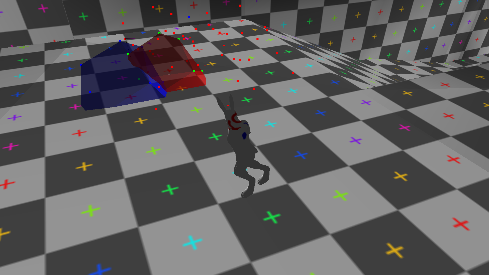

go_engine3d
========

My first 3D game engine as well as my first encounter with OpenGL and GPU programming. The project was also an exercise in using google's go language in a practical setting. I learned the hard way that a memory managed language such as go is not suitable for serious game developement after noticing that textures stay in memory way longer in memory than desired. This pushed me to go make more c/c++ codebases in the future.

## Features

* 3d skeletal animation
  - Player character has head pointing (Additive blending)
  - Player walk interpolates into run as speed increases
  - Player jump interpolates seamlessly into other animations
* GJK based collision detection
  - The red and blue polyhedra as well as the pointcloud are used for debuggin collision
* Collada and obj model file parsing
  - The go language has a powerful xml parsing facility which I used to make a limited .dae file parser (The standard is too large for me to do the whole thing during summer)
  - obj file parser
* glsl shading
  - Basic

## Scene Demo

* The third person character is running to the side while looking towards the camera's facing direction. 
* The red and blue shapers are there for convex collision debugging
  - The engine sports an implementation of a boolean version of the GJK algorithm proposed by Casey Muratori
  - The pointcloud represents the Minkowski difference of the two polyhedra
  - A collision is recognized if you can construct a simplex around the origin from the red points
